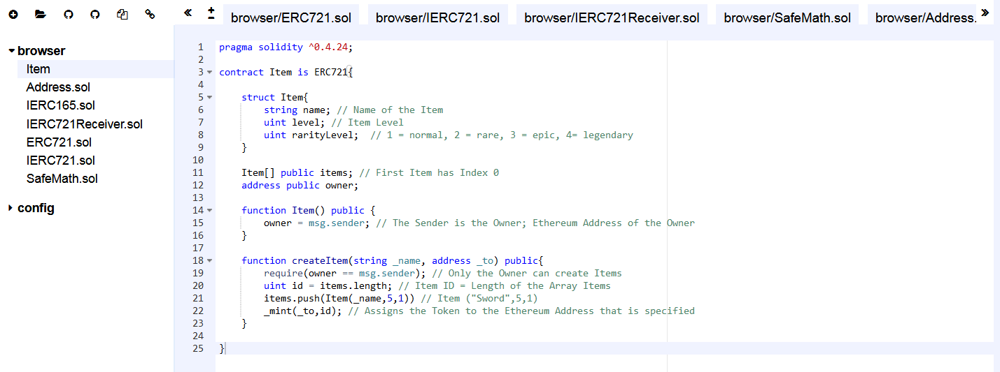

# 🔮 Simple Game ERC-721 Token Template 🔮
🔮 Very Simple **ERC-721 Smart Contract Template** to create your own **ERC-721 Tokens** on the **Ethereum** Blockchain, with many customizable Options 🔮

## 💎 What is ERC-721? 💎
**ERC-721** is a free, open standard that describes how to build non-fungible or unique tokens on the Ethereum blockchain. While most tokens are fungible (every token is the same as every other token), **ERC-721 Tokens** are all unique. 

One of the most known examples for an **ERC-721 Token** is Crypto Kitties (https://www.cryptokitties.co/), where each Cat is an unique **ERC-721 Token**. 😺

## ⚙️ Setup ⚙️

Each Line of the **Solidity Code** has a comment that explains what is happening. 📝 

The Setup is fairly easy, you just need to click on the [Remix link](https://remix.ethereum.org/#version=soljson-v0.4.25+commit.59dbf8f1.js&optimize=false&gist=6dfc6f9a27c0e6220094943657e3d834) or use the [Gist link](https://gist.github.com/AYIDouble/6dfc6f9a27c0e6220094943657e3d834) and you're done. </br>
If you have problems with it, you can also do it the good old way and add each file separately. (Takes about 1 minute)

Remix IDE Link: https://remix.ethereum.org/#version=soljson-v0.4.25+commit.59dbf8f1.js&optimize=false&gist=6dfc6f9a27c0e6220094943657e3d834

GitHub Gist Link: https://gist.github.com/AYIDouble/6dfc6f9a27c0e6220094943657e3d834

## [📝 Remix - Solidity IDE  📝](https://remix.ethereum.org/#version=soljson-v0.4.25+commit.59dbf8f1.js&optimize=false&gist=6dfc6f9a27c0e6220094943657e3d834)



### Explanation of the Code:
At Line **5–9**: In the **struct** the **Item** with all his properties is defined (**name**, **level**, **rarityLevel**).

At Line **11**: An Array is created, where all the **Items** of the contract **owner** are stored.

At Line **14–16**: We define that the **owner** is the user of the contract.

At Line **18**: We define a function **createItem**, where the **name** (**_name**) of the **Item** is a parameter and the Ethereum address (**_to**) where we want to send our **Items**.

At Line **19**: We define that only the **owner** of the contract is able to create **Items**.

At Line **20**: Each time we create an **Item** the current Length of the **Item** array is being used as the ID for the **Item**. (Each **Item** has a unique ID)

At Line **21**: The **Item** gets created and added to our **Items** array

At Line **22**: The **_mint** function from the ERC721 Libraries is used for sending our **Items** to the specific ethereum address. As an example, this is needed to send the created **Item** to your ethereum address or any other address.

## ⚔️ Item.sol ⚔️ (ERC-721 Token)

In this small example we are creating an ERC-721 Token, that could be used as an in-game Item. ⚔️

**Example: a Sword as a Item saved in the Ethereum Blockchain.**
```
pragma solidity ^0.4.24;

contract Item is ERC721{
    
    struct Item{
        string name; // Name of the Item
        uint level; // Item Level
        uint rarityLevel;  // 1 = normal, 2 = rare, 3 = epic, 4 = legendary
    }
    
    Item[] public items; // First Item has Index 0
    address public owner;
    
    function Item() public {
        owner = msg.sender; // The Sender is the Owner; Ethereum Address of the Owner
    }
    
    function createItem(string _name, address _to) public{
        require(owner == msg.sender); // Only the Owner can create Items
        uint id = items.length; // Item ID = Length of the Array Items
        items.push(Item(_name,5,1)) // Item ("Sword",5,1)
        _mint(_to,id); // Assigns the Token to the Ethereum Address that is specified
    }
    
}
```
